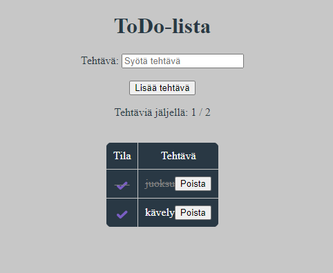

# ToDo-list
Netlify URL: 

# Project Title 

ToDo-list, created by Mikael Lönnberg

## Demo link:

Access my site at https://resilient-platypus-7e542a.netlify.app/

## How was the workload divided

Workload was done solely by Mikael Lönnberg.

## Table of Content:

- [About The App](#about-the-app)
- [Screenshots](#screenshots)
- [Technologies](#technologies)
- [Setup](#setup)
- [Approach](#approach)
- [Status](#status)
- [Credits](#credits)
- [License](#license)

## About The App

ToDo-list is an app that you can write down activities that needs to be done. You can cross activities out when completed, and delete when not necessary anymore. The app will also keep track of the number of activities being completed.

## Screenshots

Picture by [Mikael Lönnberg](https://www.linkedin.com/in/mikael-l%C3%B6nnberg-75806a194/)

## Technologies

I used the following technologies `html`, `css` and `JavaScript` for the whole project. `html`was used for the basic layout of the app. `css`was used to style the app. `JavaScript` was used for everything else. Making the table, adding rows and deleting them. Keeping track of ongoing activities and validating the user's input.

## Setup

- download all the files and open index.html in your browser
- download or clone the repository
- open index.html in browser
OR
- open the app straight from the link provided at the top.

- type in a new assignment in "Tehtävät"
- click "Lisää tehtävä"- button to add assignment
- mark an assignment as done by clicking ✔️-sign
- delete an assignment by pressing "Poista"-button
- the counter will show active and all assignments

## Status

ToDo-list is done for now. `Version 2` might me out at some point.

## Credits

-[AI](https://chatgpt.com/) used for most parts, where help was needed. For example how to get the paivitaLaskuri- function not to count in the header row and overall troubleshooting.

## License

MIT license @ [Mikael Lönnberg](https://www.linkedin.com/in/mikael-l%C3%B6nnberg-75806a194/)